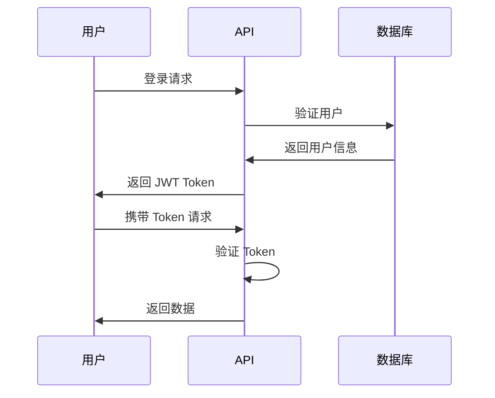

# MyExpress 企业级框架 - 功能特性详解

## 🏗️ 架构设计

### 分层架构
```
┌─────────────────┐
│   路由层 (Routes) │  ← HTTP 请求处理
├─────────────────┤
│  中间件层 (Middleware) │  ← 认证、验证、安全
├─────────────────┤
│  服务层 (Services)   │  ← 业务逻辑处理
├─────────────────┤
│  数据层 (Data)      │  ← Prisma ORM
└─────────────────┘
```

### 核心设计原则
- **单一职责**: 每个模块职责明确
- **依赖注入**: 松耦合的组件设计
- **配置驱动**: 通过环境变量控制行为
- **错误优先**: 完善的错误处理机制

## 🔐 身份验证与授权

### JWT 认证流程


### 角色权限系统
| 角色 | 权限 |
|------|------|
| **USER** | 基本用户权限，可管理自己的资源 |
| **MODERATOR** | 内容管理权限，可管理文章和评论 |
| **ADMIN** | 系统管理权限，可管理所有资源 |

## 🛡️ 安全防护机制

### 多层安全防护
1. **输入验证**: express-validator 参数验证
2. **XSS 防护**: 输入内容清理和转义
3. **CSRF 防护**: CSRF token 验证
4. **SQL 注入**: Prisma ORM 参数化查询
5. **速率限制**: IP 和 API 级别的速率控制
6. **安全头**: Helmet.js 设置安全 HTTP 头

### 密码安全
- bcrypt 加密存储
- 强密码策略验证
- 密码重置功能
- 会话管理

## 📊 性能与监控

### 缓存策略
```
┌─────────────┐    ┌─────────────┐    ┌─────────────┐
│    客户端     │    │    Redis    │    │   数据库     │
│    Cache    │ ←→ │   Cache     │ ←→ │ PostgreSQL  │
└─────────────┘    └─────────────┘    └─────────────┘
```

### 日志系统
- **Winston 日志器**: 结构化日志输出
- **日志级别**: ERROR → WARN → INFO → DEBUG
- **日志轮转**: 按日期自动轮转，避免磁盘空间问题
- **HTTP 日志**: 记录所有 API 请求详情

### 健康监控
```javascript
// 健康检查端点
GET /api/health          // 基本健康状态
GET /api/health/detailed // 详细健康信息
GET /api/health/readiness // K8s 就绪探针
GET /api/health/liveness  // K8s 存活探针
```

## 🗄️ 数据库设计

### 核心数据模型
```sql
-- 用户表
User {
  id: String (主键)
  email: String (唯一)
  username: String (唯一)
  password: String (加密)
  role: Enum (USER|ADMIN|MODERATOR)
  status: Enum (ACTIVE|INACTIVE|SUSPENDED)
}

-- 文章表
Post {
  id: String (主键)
  title: String
  content: String
  slug: String (唯一)
  published: Boolean
  authorId: String (外键)
}

-- 评论表
Comment {
  id: String (主键)
  content: String
  postId: String (外键)
  authorId: String (外键)
}
```

### 数据库特性
- **关系映射**: Prisma 自动处理关联关系
- **类型安全**: 完整的 TypeScript 类型支持
- **迁移管理**: 版本化的数据库迁移
- **查询优化**: 内置查询性能分析

## 🚀 API 设计规范

### RESTful API 规范
```
GET    /api/users       # 获取用户列表
POST   /api/users       # 创建用户
GET    /api/users/:id   # 获取指定用户
PUT    /api/users/:id   # 更新指定用户
DELETE /api/users/:id   # 删除指定用户
```

### 统一响应格式
```json
{
  "success": true,
  "message": "操作成功",
  "data": { ... },
  "timestamp": "2024-01-18T10:30:00Z"
}
```

### 错误处理
```json
{
  "success": false,
  "message": "参数验证失败",
  "error": "详细错误信息",
  "timestamp": "2024-01-18T10:30:00Z"
}
```

## 📚 API 文档系统

### Swagger/OpenAPI 集成
- **自动生成**: 从代码注释自动生成文档
- **交互式**: 可直接在文档中测试 API
- **版本管理**: 支持 API 版本控制
- **类型定义**: 完整的请求/响应类型说明

### 文档特性
- 实时更新
- 参数说明
- 示例代码
- 错误码说明

## 🧪 测试框架

### 测试策略
```
┌─────────────┐
│  单元测试    │  ← 业务逻辑测试
├─────────────┤
│  集成测试    │  ← API 接口测试
├─────────────┤
│  端到端测试   │  ← 完整流程测试
└─────────────┘
```

### 测试工具
- **Jest**: 测试运行器和断言库
- **Supertest**: HTTP 接口测试
- **测试辅助**: 自定义测试工具和数据生成
- **覆盖率**: 代码覆盖率报告

## 🐳 容器化部署

### Docker 多阶段构建
```dockerfile
# 开发阶段
FROM node:18-alpine AS development

# 构建阶段
FROM node:18-alpine AS build

# 生产阶段
FROM node:18-alpine AS production
```

### 容器编排
```yaml
# docker-compose.yml
services:
  app:        # Express 应用
  postgres:   # PostgreSQL 数据库
  redis:      # Redis 缓存
  nginx:      # 反向代理
```

## 🔧 开发工具链

### 代码质量工具
- **ESLint**: 代码规范检查
- **Prettier**: 代码格式化
- **TypeScript**: 类型检查
- **Husky**: Git 钩子管理

### 开发体验
- **热重载**: nodemon 自动重启
- **类型提示**: 完整的 IDE 支持
- **调试支持**: VS Code 调试配置
- **脚本管理**: npm scripts 任务管理

## 📈 性能优化

### 优化策略
1. **数据库索引**: 为常用查询字段添加索引
2. **查询优化**: 使用 Prisma 查询分析
3. **缓存策略**: Redis 缓存热点数据
4. **压缩传输**: gzip 压缩 HTTP 响应
5. **连接池**: 数据库连接池管理

### 监控指标
- **响应时间**: API 接口响应时间
- **吞吐量**: 每秒处理请求数
- **错误率**: API 错误比例
- **系统资源**: CPU、内存、磁盘使用率

## 🌐 生产环境部署

### 部署清单
- [ ] 环境变量配置
- [ ] 数据库迁移
- [ ] SSL 证书配置
- [ ] 负载均衡设置
- [ ] 监控告警配置
- [ ] 备份策略制定

### 运维特性
- **优雅关闭**: 处理 SIGTERM 信号
- **健康检查**: Kubernetes 就绪探针
- **日志管理**: 集中式日志收集
- **配置管理**: 环境变量和配置文件

---

这个企业级 Express 框架为现代 Web 应用提供了完整的基础设施和最佳实践，让您专注于业务逻辑的实现。